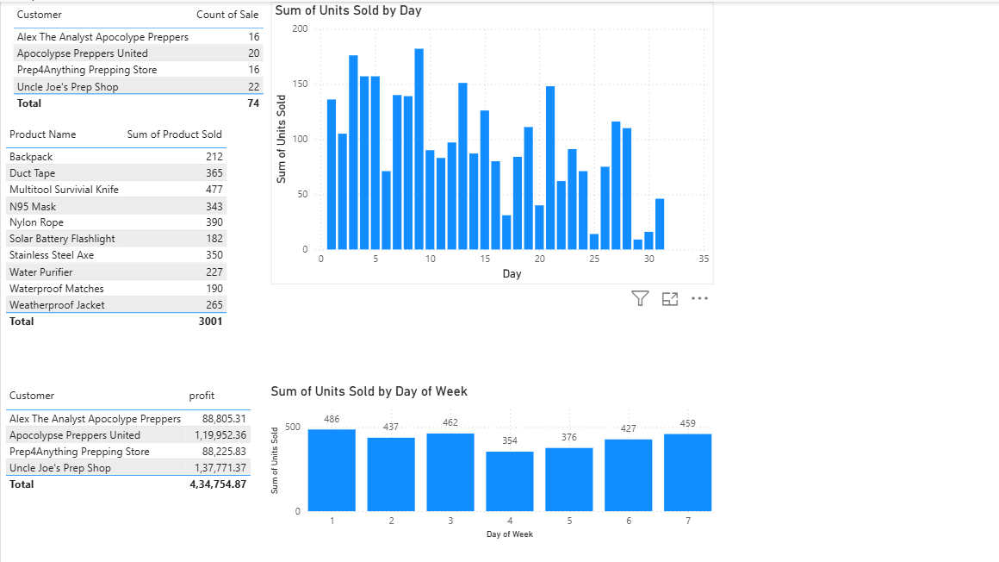
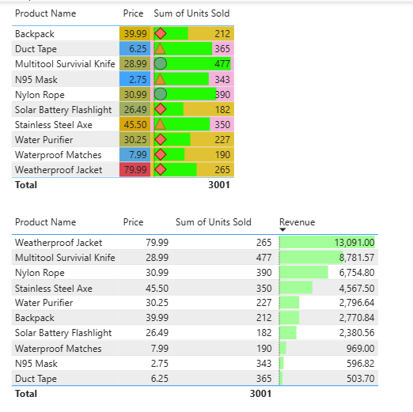
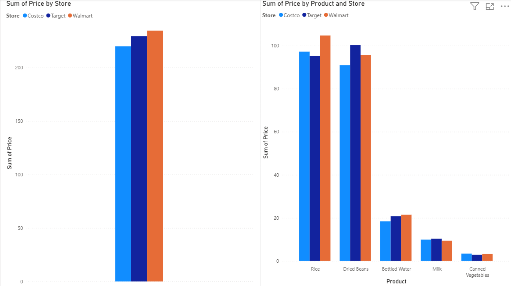

# 📊 Power BI Dashboard Project

## 📊 Dashboard 1 – Sales Performance Analysis

This dashboard provides an analysis of customer-wise sales, product performance, daily units sold, and weekly sales trends.

---

## 💰 Dashboard 2 – Product and Revenue Analysis

This dashboard analyzes product prices, total units sold, and revenue generated by different products.

---

## 🏪 Dashboard 3 – Store and Product Analysis

This dashboard compares product prices across different stores, including Costco, Target, and Walmart.
